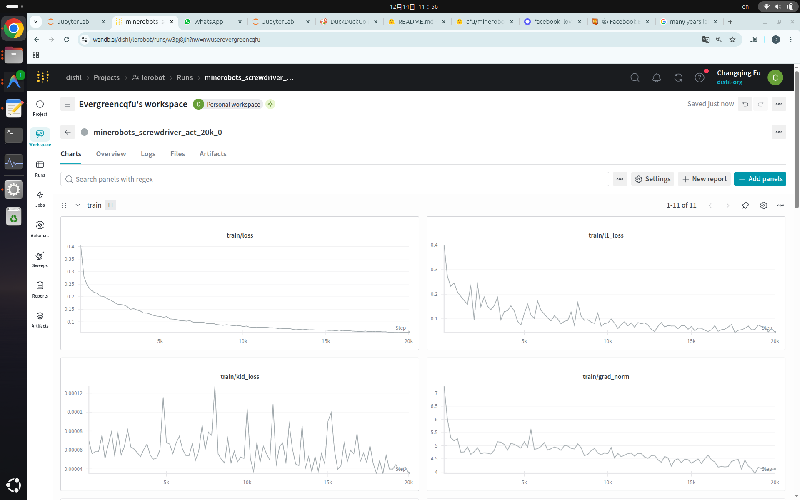

# MineRobots

#### *“Many years later, as he faced the screwdriver, LeRobot was to remember that distant afternoon when he grabbed that red ball..."*


## AMD_Robotics_Hackathon_2025_MineRobots

Welcome to the **Hug-n-Play** project by Team **MineRobots**. Our solution features an SO-100 robot arm powered by AMD ROCm and Hugging Face LeRobot, trained to identify tools, "hug" them securely, and perform a celebratory "winning dance" upon successful retrieval.

<video controls width="640">
  <source src="https://changqingfu.com/pdf/hug_n_play_music.mp4" type="video/mp4">
</video>


[](https://youtu.be/ZWQNqGcDaM4)


*Figure 1 ([video](assets/hug_n_play_music.mp4)): MineRobot performing the "Hug" (grasp) and the intentional "Winning Dance" (shake) before handover.*

### Submission Details
*   **Team Name:** MineRobots
*   **Project Name:** Hug-n-Play
*   **Task:** `minerobots-pick-screwdriver`
*   **Goal:** Autonomous identification, grasping ("hugging"), celebration dance, and handover of a screwdriver.
*   **Model:** Action Chunking with Transformers (ACT) & XVLA trained on AMD MI300X.

## 🛠️ Technical Specifications & Workflow

### Configuration & Installation
```bash
git clone https://github.com/huggingface/lerobot.git --depth 1
cd lerobot
pip install -U pip
pip install -e .
```

### Robot Calibration
**Leader Arm:**
```bash
lerobot-calibrate --teleop.type=so101_leader --teleop.port=/dev/ttyACM1 --teleop.id=minerobots_leader
```
**Follower Arm:**
```bash
lerobot-calibrate --robot.type=so101_follower --robot.port=/dev/ttyACM0 --robot.id=minerobots_follower
```

### Teleoperation (Data Collection)
To record the dataset, we utilized a 3-camera setup (Side, Top, Wrist) to capture the hugging motion.

```bash
lerobot-teleoperate \
  --robot.type=so101_follower \
  --robot.port=/dev/tty.usbmodem5AE60570611 \
  --robot.id=so101_follower_mac \
  --robot.cameras="{side: {type: opencv, index_or_path: 0, width: 1920, height: 1080, fps: 30}, arm: {type: opencv, index_or_path: 2, width: 1920, height: 1080, fps: 30}, top: {type: opencv, index_or_path: 1, width: 1920, height: 1080, fps: 24}}" \
  --teleop.type=so101_leader \
  --teleop.port=/dev/tty.usbmodem5AE60848661 \
  --teleop.id=so101_leader_mac \
  --display_data=true
```

---

## 🧠 Training (AMD MI300X)

We utilized the AMD MI300X to train our models.



### Option 1: Finetune ACT (Action Chunking with Transformers)
Used for the `minerobots-screwdriver` task.

```bash
export HF_USER=cfu
export DATASET_NAME=minerobots-screwdriver
export REPO_NAME=minerobots-screwdriver-act-20k
lerobot-train \
  --dataset.repo_id=cfu/${DATASET_NAME} \
  --steps=30000 \
  --policy.type=act \
  --policy.pretrained_path=cfu/minerobots-ball-act-100k \
  --output_dir=outputs/train/${REPO_NAME} \
  --job_name=${REPO_NAME} \
  --policy.device=cuda \
  --wandb.enable=true \
  --policy.push_to_hub=true \
  --policy.repo_id=${HF_USER}/${REPO_NAME}
```

### Option 2: Finetune XVLA (Vision-Language-Action)
Requires `lerobot >= 0.4.3`.

```bash
export DATASET_NAME=minerobots-pick-screwdriver
export REPO_NAME=minerobots_screwdriver_xvla_50k
lerobot-train \
  --dataset.repo_id=cfu/${DATASET_NAME} \
  --policy.optimizer_lr=0.0001 \
  --steps=50000 \
  --policy.action_mode=auto \
  --policy.type=xvla \
  --policy.pretrained_path=lerobot/xvla-base \
  --output_dir=outputs/train/${REPO_NAME} \
  --job_name=${REPO_NAME} \
  --policy.device=cuda \
  --wandb.enable=true \
  --policy.push_to_hub=true \
  --policy.repo_id=cfu/${REPO_NAME} \
  --policy.resize_imgs_with_padding=[224,224] 
```

---

## 🚀 Inference

Running the inference on the Edge device to perform the "Hug-n-Play" sequence.

```bash
lerobot-record \
  --robot.type=so101_follower \
  --robot.port=/dev/ttyACM0 \
  --robot.cameras="{side: {type: opencv, index_or_path: 2, width: 640, height: 480, fps: 30}, top: {type: opencv, index_or_path: 6, width: 640, height: 480, fps: 30}, wrist: {type: opencv, index_or_path: 4, width: 640, height: 480, fps: 30}}" \
  --policy.path=cfu/minerobots-srewdriver-act-20k \
  --dataset.repo_id=lerobot/eval_inference_v58 \
  --dataset.single_task="inference_act" \
  --dataset.num_episodes=10 \
  --dataset.reset_time_s=0 \
  --display_data=false
```

---

## 🔧 Utilities: Motor Configuration

If using Feetech STS3215 motors, use the scripts provided in [AMDYES.md](mission/code/AMDYES.md) to scan and change motor IDs.

1.  **Scan Motors:** Checks baud rates (1M/500k/250k/115200).
2.  **Change ID:** Unlocks EEPROM, writes new ID, and re-locks.

---

## 👥 Team Info

**Team MineRobots (Alphabetical Order)**
*   **Changqing Fu**
*   **Sichen Su**
*   **Wenzheng Wang**

## 📄 Reference
*  [Learning Fine-Grained Bimanual Manipulation with Low-Cost Hardware](https://arxiv.org/abs/2304.13705) by Zhao et al.
*  [LeRobot](https://huggingface.co/docs/lerobot) by HuggingFace.